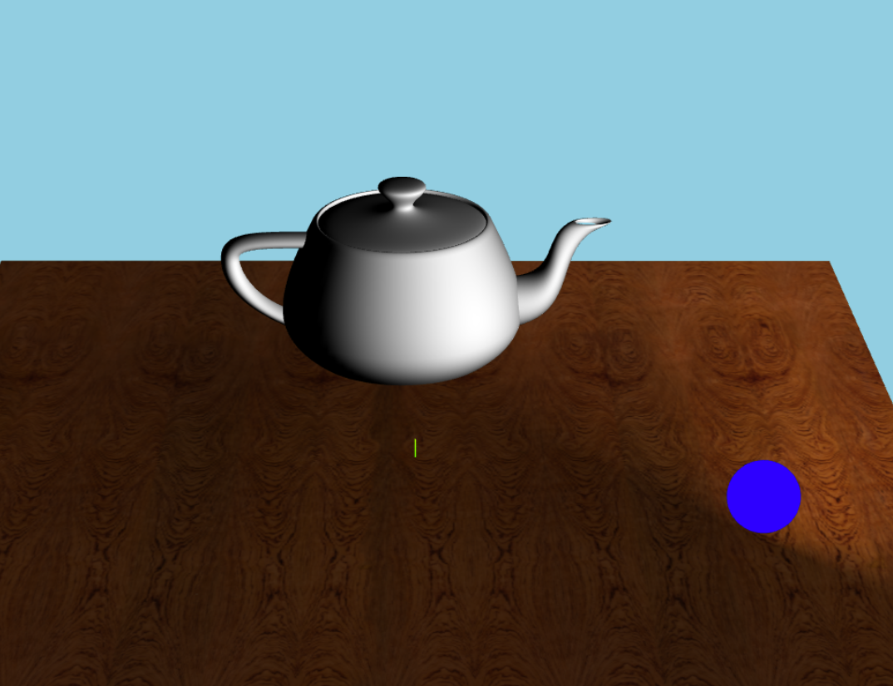
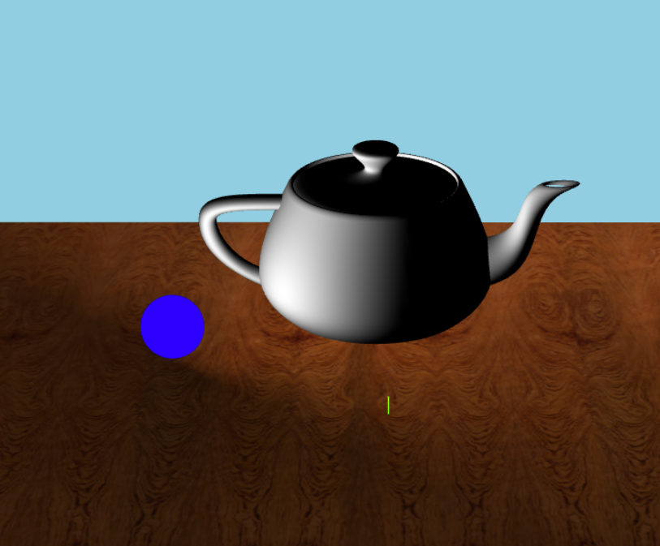
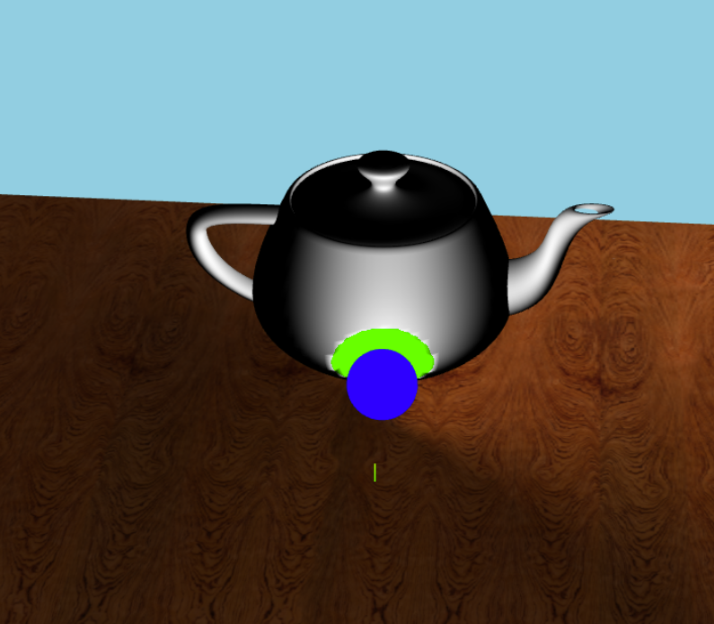
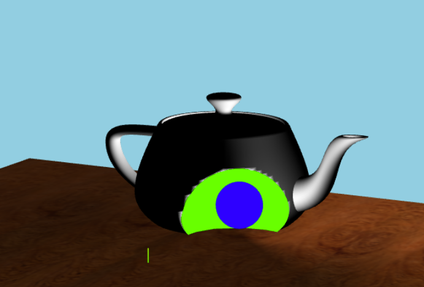

# CS 4361 Assignment 1: Hello Teapot! Introduction to Three.js, WebGL, and Shaders

**Student Name:** Laxmi Komaragiri 
**Student Number:** 2021774290  
**NetID:** lak230000  

## Assignment Overview

This assignment introduces Three.js, WebGL, and shader programming through the creation of an interactive 3D scene featuring a "Teapot" character and a magical "Orb" that interacts with it.

## Part 1: Required Elements (100 pts)

### (a) Moving & Coloring the Orb (20 pts)

**Requirements:**
- Modify sphere vertex shader to move the orb in response to keyboard input
- Change orb color to blue using fragment shader
- Must modify shaders, not use Three.js functions

**Implementation:**
I modified the shader to move the orb, by offseting the vertex at the local. Since orbPosition is a uniform variable, everytime there was keyboard input, it modified the orbPosition vector. This vector was added to the position vector to move the orb. 

I changed the color of the orb to blue by changing the values in the gl_FragColor vector. The first three values in the vector represent the percent of the colors, red, blue and green. I set red and green to 0 and blue to 1.0.

**Files Modified:**
- `glsl/sphere.vs.glsl`
- `glsl/sphere.fs.glsl` 

**Key Code Snippets:**
```glsl
    vec3 worldPos = position + orbPosition;
    gl_Position = projectionMatrix * viewMatrix * modelMatrix * vec(worldPos, 1.0);
    gl_FragColor = vec4(0.0, 0.0, 1.0, 1.0); 

```

---

### (b) Lighting the Teapot (20 pts)

**Requirements:**
- Implement Gouraud shading
- Light teapot based on cosine of angle between vertex normal and direction to orb center
- Orb should "activate" and light different parts of teapot as it moves

**Implementation:**
First I converted the normal vector to world coordinates by multiplying it with the normalMatrix. Then I normalized the vector.
This will give a vector on the surface of the object  that is 90 degrees to the surface, and is length 1. 

Next I found the vector for the teapot to the orb byt subtracting the position of the teapot in world coordinates from orbPosition.

Now, I have two units vectors, one that is normal to the surface of the teapot and one that points to the orb. I calculated the cosine between these by using the dot() function. I set the intensity to be the max between the dot() and 0.0, to prevent negative values of intensity.


**Files Modified:**

- `glsl/teapot.vs.glsl`

**Key Code Snippets:**
```glsl
    vec3 world_position_normal = normalize(normalMatrix * normal);
    light_direction = normalize(orbPosition - finalWorldPos);
    intensity = max(dot(world_position_normal, light_direction), 0.0);
```

---

### (c) Proximity Detection (30 pts)

**Requirements:**
- Color teapot fragments green when in close proximity to the sphere
- Check if teapot fragment is within specified distance to sphere
- Implement in fragment shader

**Implementation:**
In the vector shader I created a varying float variable called distanceVal.  I then calculated the distance between the position of the teapot and the orb. 

In the fragment shader, I used to the distaceVal to determine proximity. If the distanceVal was less than the orbRadius, the color would be green times the intensity, other white times the intensity. 
Using orbRadius to compare the distanceVal makes sure the green part aligns with the deformed area. 

**Files Modified:**
- `glsl/teapot.fs.glsl`
-`glsl/teapot.fs.glsl`

**Key Code Snippets:**
```glsl
out float distanceVal;
distanceVal = length(world_position - orbPosition); 

vec3 baseColor;
	if (distanceVal <= orbRadius){
		baseColor = vec3(0.0, 1.0, 0.0) * intensity;
	}
	else{
		baseColor = vec3(1.0, 1.0, 1.0) * intensity;

	}
		gl_FragColor = vec4(baseColor, 1.0); 
```

---

### (d) Body Deformation (30 pts)

**Requirements:**
- Indent teapot's mesh when pushed in by the Orb
- Check if vertex is within Orb and move vertex to surface if so
- Demonstrate vertex shader shape modification

**Implementation:**
In A1.js, I created a uniform varible called orbRadius and set it to some value and passed it into teapotMaterial. 

Then I modified SphereGeometry so that is smaller than whatever value was set for orbRadius. 

In the vector shader, I compared distanceVal(distance between teapot and orb) with orbRadius. this shows the boundary where the deformation happens.

I created a unit vector pushDir that points from the center of the orb to the vertex. 

finalWorldPos is updated so that the vertex outward go inward. Because the uniform value of the orbRadius in the teapot is greater than the actual radius of the orb, the teapot deforms to create a gap between the orb and the the surface of the teapot.

The new normal in world coodinrates is the unit vector pushDir, because the surface is deformed.

the light direction is also set to pushDir because otherwise light_direction and world_position_normal would be 180 degrees which is cosine(180) = -1.0. This -1.0 gets clamped to 0.0, and the inside of the deformed area is black. So the light direction needs to be flipped so that they both point in the same direction. This gives us cosine(0) = 1.0 and lights up the inside of the deformed area.

If the distanceVal is not less than orbRadius, then it defaults to the gourand shading light direction.

**Files Modified:**
- `glsl/teapot.vs.glsl`
- `A1.js`

**Key Code Snippets:**
```glsl
const orbRadius = { value: 2.5 };
const teapotMaterial = new THREE.ShaderMaterial({
  uniforms: {
    orbPosition: orbPosition,
    orbRadius: orbRadius
  }
});

const sphereGeometry = new THREE.SphereGeometry((orbRadius.value*0.4), 32.0, 32.0);
 

 if (distanceVal <= orbRadius) {
        vec3 pushDir = normalize(world_position - orbPosition);
        
        finalWorldPos = orbPosition + (pushDir * orbRadius);
        
        world_position_normal = pushDir;
        light_direction = pushDir;
    } else {
        light_direction = normalize(orbPosition - finalWorldPos);
    }

    intensity = max(dot(world_position_normal, light_direction), 0.0);

    gl_Position = projectionMatrix * viewMatrix * vec4(finalWorldPos, 1.0);
```

---

## Part 2: Creative License (Optional - Bonus up to 10 pts)
[If you completed Part 2, describe your creative extensions here]
**Creative Features Implemented:**
- [Feature 1]: [Description]
- [Feature 2]: [Description]
- [etc.]

**Files Modified:**
- [List files you modified for creative features]


## Screenshots
[Include screenshots of your working program showing each part's functionality]
- **Blue Orb:** 
- **Lit Teapot:** 
- **Proximity Detection:** 
- **Body Deformation:** 

